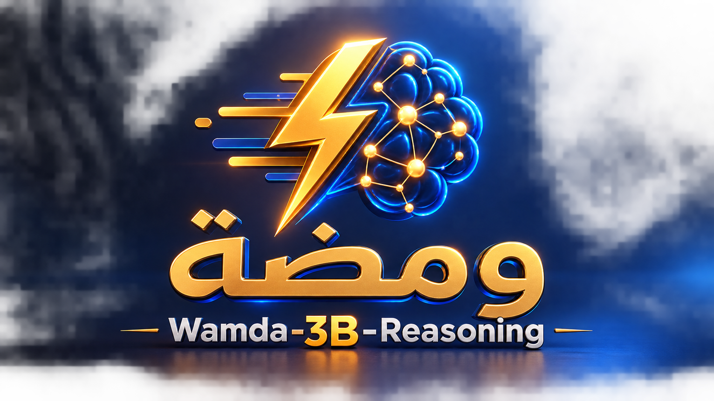
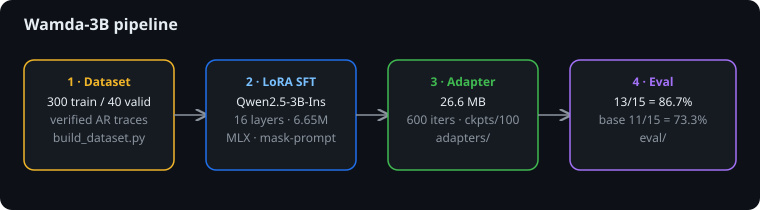
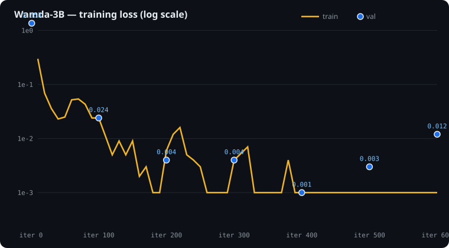

# Wamda-3B-Reasoning — ومضة

<p align="center">
  
</p>

<p align="center">
  <a href="https://github.com/seyhunak/wamda-3b-reasoning"></a>
  <a href="https://huggingface.co/seyhunak/Wamda-3B-Reasoning"></a>
</p>

A small Arabic reasoning model: **Qwen2.5-3B-Instruct** fine-tuned with LoRA to reason
step-by-step in Arabic inside native `<think>...</think>` tags before answering.
Trained end-to-end on a Mac with [MLX](https://github.com/ml-explore/mlx),
built to run on a laptop.

## Results

15-question Arabic eval (`eval/eval_set.jsonl`, greedy decoding, substring match on the
final answer), 2026-09-05:

| Model | Score |
|---|---|
| Qwen2.5-3B-Instruct (base) | 11/15 = **73.3%** |
| **Wamda-3B (LoRA, 600 iters)** | 13/15 = **86.7%** |

**Gains vs base (+4):** the 3-pill trap (1 hour, not 1.5), the boxes word problem
(18 SAR), age algebra (Sara = 21), discount+VAT (3680). The `<think>` structure does
its job on multi-step problems the base model fumbles.

**Regressions vs base (−2):** raw multi-digit multiplication the base got right —
`47 × 36` and `13 × 17`. A common first-pass SFT trade-off: the format-tuning
improves reasoning structure while narrow synthetic data can cost raw arithmetic.
Fix: more pure-arithmetic drills (see [Roadmap](#roadmap)).

Full per-question breakdown in [Evaluation](#evaluation).

## Approach

| | Wamda-3B-Reasoning (this repo) |
|---|---|
| Base | Qwen2.5-3B-Instruct |
| Method | LoRA SFT (16 layers, 6.65M trainable = 0.216%), `<think>` CoT, prompt-masked loss |
| Training data | 300 synthetic AR math/logic + 3 handwritten trap/logic (generated in-repo) |
| Hardware | Reference run: MacBook Pro (M3 Max, 48 GB) via MLX, ~11.2 GB peak · Recommended for larger runs: NVIDIA A100 80 GB / H100, or 64 GB+ unified memory |
| Eval | 15-Q Arabic set → 86.7% (base 73.3%); Arabic-GSM8K sample _todo_ |
| Natural follow-up | RL (DPO/GRPO) to align structured traces with correct answers |

<p align="center">
  
</p>

## Repository structure

```
wamda-3b-reasoning/
├── README.md                 # this file
├── LICENSE.md                # MIT (repo code/scripts/docs)
├── requirements.txt          # mlx-lm (pinned floor: >=0.22; tested on 0.31.3)
├── .gitignore                # venv, *.safetensors, logs-adjacent scratch
├── scripts/
│   ├── build_dataset.py      # deterministic Arabic <think> dataset generator
│   ├── train.sh              # one-command LoRA SFT (ITERS=/BATCH=/LR= overrides)
│   ├── chat.py               # single-prompt inference (base or +adapter)
│   └── plot_loss.py          # regenerate public/assets/loss-curve.svg from logs/full.log
├── public/
│   └── assets/
│       ├── logo.png          # project logo (hero banner above)
│       ├── pipeline.svg      # pipeline diagram (Approach section)
│       └── loss-curve.svg    # training loss chart (Training section; regenerate via plot_loss.py)
├── data/
│   ├── train.jsonl           # 300 examples (regenerate anytime)
│   └── valid.jsonl           # 40 examples
├── eval/
│   ├── eval_set.jsonl        # 15 Arabic questions + expected substrings
│   ├── eval.py               # greedy eval via mlx_lm.generate CLI
│   ├── results_adapter.json  # full outputs, Wamda-3B
│   └── results_base.json     # full outputs, base model
├── configs/                  # reserved for training configs (currently CLI flags in train.sh)
├── adapters/                 # LoRA weights: adapters.safetensors + 100-iter checkpoints (git-ignored)
└── logs/                     # smoke.log, full.log, eval_*.log (git-ignored)
```

## Requirements

- **A recent Mac with an M-series chip** (developed and tested on a MacBook Pro with
  M3 Max and 48 GB unified memory). MLX runs only on Apple silicon;
  for NVIDIA/Linux use Unsloth + TRL instead (different stack, same data works).
- **Python 3.11.** MLX has no wheels for 3.14, and the 3.12 install on this machine
  fails at `ensurepip` — 3.11 is the verified path:
  `/opt/homebrew/bin/python3.11` (or `/usr/local/bin/python3.12` if your venv builds).
- ~8 GB disk for the base-model cache (`~/.cache/huggingface`) + ~200 MB for adapters/logs.
- Tested versions: `mlx-lm 0.31.3`, `mlx 0.32.2`, `transformers 5.16.1`, `tokenizers 0.23.2`.

## Quickstart

```bash
cd ~/Projects/wamda-3b-reasoning

# 1. Environment
/opt/homebrew/bin/python3.11 -m venv .venv
./.venv/bin/pip install -r requirements.txt

# 2. Dataset (deterministic; change --seed / counts to resample)
/usr/bin/python3 scripts/build_dataset.py --train-n 300 --valid-n 40 --seed 7

# 3. Smoke test (~10 min incl. one-time ~6 GB base download, ~1 min training)
ITERS=50 ./scripts/train.sh

# 4. Full run (~15 min on the M3 Max test machine: ~12 min download once, ~12 min for 600 iters)
./scripts/train.sh
# overrides: ITERS=1000 BATCH=8 LR=5e-5 BASE_MODEL=Qwen/Qwen2.5-3B-Instruct ./scripts/train.sh

# 5. Chat
./.venv/bin/python scripts/chat.py "كم يساوي 47 × 36؟" --base-only   # base model
./.venv/bin/python scripts/chat.py "كم يساوي 47 × 36؟"               # + Wamda adapter

# 6. Eval (15 Qs, ~10 min each side; writes eval/results_{base,adapter}.json)
./.venv/bin/python eval/eval.py --base-only
./.venv/bin/python eval/eval.py
```

## Prompt format

The prompt format: Qwen ChatML with an Arabic system line, assistant turn prefilled with
an open `<think>` tag so the model completes the trace, closes it, then answers:

```python
prompt = """<|im_start|>system
أنت مساعد رياضيات بارع. فكّر خطوة بخطوة داخل <think> قبل إعطاء الإجابة النهائية.<|im_end|>
<|im_start|>user
[سؤالك هنا]<|im_end|>
<|im_start|>assistant
<think>
"""
```

Example output (Wamda-3B, unseen question — pens: 4 boxes × 15, gift a third):

```text
<think>
الخطوة 1: احسب العدد الإجمالي: 4 × 15 = 60 قلمًا
الخطوة 2: احسب عدد الأقلام المتبرع به: 60 / 3 = 20 قلمًا
الخطوة 3: احسب المتبقي: 60 − 20 = 40 قلمًا
</think>

40
```

## Dataset design

`scripts/build_dataset.py` generates arithmetically **verified** examples (every number in
the trace is computed, not hallucinated) in mlx-lm chat format —
`{"messages": [system, user, assistant]}` — with the assistant response wrapping numbered
Arabic steps in `<think>...</think>` plus a final answer line.

| Generator | Count (train) | Skills covered |
|---|---|---|
| `gen_boxes` | ~43 | Multi-step: total → halve → third → price |
| `gen_cups` | ~43 | Pairs pricing with % discount |
| `gen_discount_vat` | ~43 | % discount then VAT on remainder |
| `gen_age` | ~43 | Age algebra (solve linear equation) |
| `gen_speed` | ~43 | Distance / speed / time |
| `gen_apples` | ~43 | Halve then add |
| `gen_mult` | ~43 | Long multiplication with partial products |
| Handwritten (3) | 3 | Pill-trap (correct: 1h), 28-day-months (correct: 12, full reasoning), race ordering |

Known gap: only one generator covers raw arithmetic, and word problems dominate —
hence the multiplication regressions. The generator makes this cheap to fix: add drill
generators, rebuild, retrain.

## Training details

- Base: `Qwen/Qwen2.5-3B-Instruct` (auto-downloaded to HF cache on first run).
- LoRA: 16 layers, `--mask-prompt` (loss on assistant tokens only), lr 1e-4,
  batch 4, AdamW default. Trainable: **6.652M / 3085.939M (0.216%)**.
- Smoke: 50 iters → train 0.025, val 0.087 (from 1.353). Format learned immediately.
- Full: 600 iters, ~0.6–1.0 it/s, ~300–500 tok/s, 289k trained tokens, peak 11.192 GB.

Loss curve (full run, from `logs/full.log` — regenerate with `scripts/plot_loss.py`):

<p align="center">
  
</p>

| Iter | Train loss | Val loss |
|---|---|---|
| 1 | — | 1.353 |
| 100 | 0.024 | 0.024 |
| 200 | 0.006 | 0.004 |
| 300 | ~0.002 | 0.004 |
| 400 | 0.000 | 0.001 |
| 500 | ~0.001 | 0.003 |
| 600 | 0.001 | 0.012 |

Val bottoms around iter 400 then ticks up (0.001 → 0.012) — mild overfitting on the
small synthetic set. Checkpoints every 100 iters are kept (`adapters/0000*_adapters.safetensors`);
if you care about generalization over format-crispness, `0000400` may be the better
checkpoint. Final adapter: `adapters/adapters.safetensors` (26.6 MB).

## Evaluation

Method: for each question in `eval/eval_set.jsonl`, build the prompt from the
[Prompt format](#prompt-format) section,
generate greedily (`temp 0.0`, 256 tokens) via the `mlx_lm.generate` CLI with or without
`--adapter-path`, and check whether the text after `</think>` (fallback: whole output)
contains the expected substring. Results + full outputs are saved to
`eval/results_{base,adapter}.json`.

Wamda-3B (adapter), 13/15:

| # | Question (summary) | Expected | Hit |
|---|---|---|---|
| 1 | 47 × 36 | 1692 | ❌ |
| 2 | 24 apples, halve, +10 | 22 | ✅ |
| 3 | Train 80 km/h, 240 km | 3 | ✅ |
| 4 | 3 pills every ½h | ساعة واحدة | ✅ |
| 5 | Months with 28 days | 12 | ✅ |
| 6 | 3 boxes × 24, donate half, sell third @1.5 | 18 | ✅ |
| 7 | Sara 3× brother, sum 38 in 5y | 21 | ✅ |
| 8 | 4000 −20% +15% VAT | 3680 | ✅ |
| 9 | 16 cups, 2nd at 60% | 64 | ✅ |
| 10 | Race ordering | ماجد | ✅ |
| 11 | 13 × 17 | 221 | ❌ |
| 12 | 45 sheep, sell third, +10 | 40 | ✅ |
| 13 | 100 km/h × 3h | 300 | ✅ |
| 14 | 200 −25% | 150 | ✅ |
| 15 | Half of 50, +10 | 35 | ✅ |

Base model, 11/15 — passes #1 and #11 (raw mult) but fails #4, #6, #7, #8.

Caveats: 15 hand-picked questions, substring matching (lenient), single greedy sample each.
This measures format-following + basic Arabic math, not general reasoning. The honest
benchmark — an Arabic-GSM8K sample under a standard greedy exact-match protocol — is still open.

Cosmetic bug: `eval.py`'s saved `output_tail` captures CLI stderr (progress bars) rather
than the generation tail; **verdicts are unaffected** (scored against full stdout+stderr),
but don't use `output_tail` for qualitative review — rerun `chat.py` for that.

## Known limitations

1. Raw multi-digit arithmetic regressed vs base (see above) — needs drill data.
2. 300-example synthetic set: narrow distribution, near-memorization by iter 400.
3. Arabic-only tuning; English/code behavior unverified (likely degraded vs base).
4. No RL alignment yet — SFT-only first pass.
5. MLX-only stack; weights are LoRA adapters, not a merged standalone model.

## Roadmap

- [ ] Arithmetic drill generators (mult/div/fractions, 500+) + retrain; compare `0000400` vs final
- [ ] Arabic-GSM8K sample eval (greedy exact-match protocol)
- [ ] Scale data to 1–5k with harder multi-step Arabic word problems
- [ ] DPO/GRPO alignment on corrected traces
- [ ] Fuse adapter → 4-bit quant → GGUF/Ollama export for a local Arabic math assistant
- [ ] NVIDIA/Colab port (Unsloth + TRL) for larger runs

## Reproducibility

- Dataset seed: `--seed 7` (default). Same seed + counts ⇒ byte-identical `train.jsonl`.
- Logs kept in `logs/`: `smoke.log`, `full.log`, `eval_adapter.log`, `eval_base.log`.
- Checkpoints every 100 iters allow re-evaluating any point on the curve.

## License & credits

- This repo's code, scripts, dataset generator, and docs: MIT — see [LICENSE.md](LICENSE.md).
- Base model Qwen2.5-3B-Instruct: see [Qwen license](https://huggingface.co/Qwen/Qwen2.5-3B-Instruct).
  Derivative adapters inherit its terms — check before redistributing.
- Built with [MLX LM](https://github.com/ml-explore/mlx-lm) on Mac.
